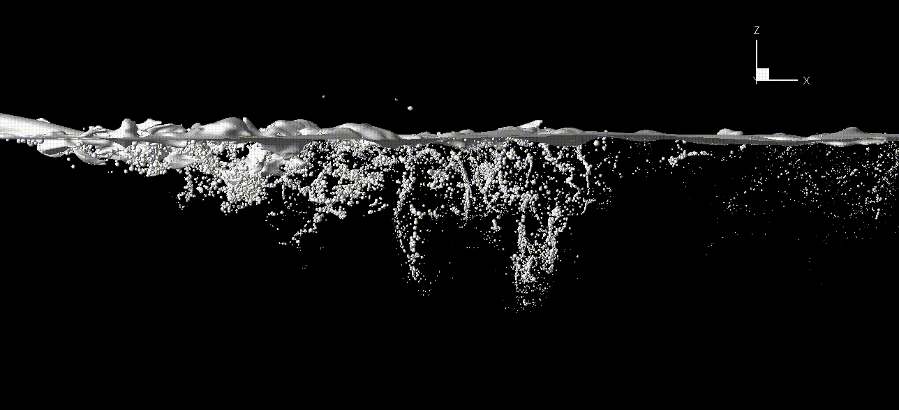
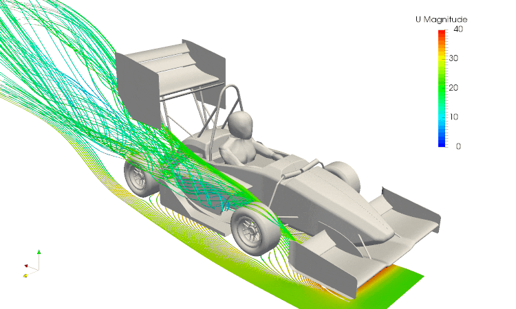

<!DOCTYPE html>
<html lang="en">
<head>
    <meta charset="UTF-8">
    <meta http-equiv="X-UA-Compatible" content="IE=edge">
    <meta name="viewport" content="width=device-width, initial-scale=1.0">
    <title>frontpage</title>
    <link rel="stylesheet" href="frontpage.css">
</head>
<body>

  

    <a class="active" href="frontpage.html">Frontpage</a>
    <a href="calculator.html">Solve</a>
    <a href="#contact">Contact</a>
    <a href="#about">About</a>
    

      <button class="dropbtn">Subtopics
        <i class="fa fa-caret-down"></i>
      </button>
      

        <a href="viscosity.html">Viscosity</a>
        <a href="surfaceTension.html">Surface Tension</a>
        <a href="newtonianNonNewtonian.html">Newtonian/Non-Newtonian</a>
        <a href="fluidStatics.html">Fluid Statics</a>
        <a href="fluidDynamics.html">Fluid Dynamics</a>
        <a href="controlVolume.html">Control Volume</a>
        <a href="massCons.html">Mass Conservation</a>
        <a href="momentumCons.html">Momentum Conservation</a>
        <a href="Energycons.html">Energy Conservation</a>
        
    
 
  

    
  
   

    <h1 class="box1" style="font-size: 300%;">FLUID MECHANICS OUTREACH
        
    </h1>
 

<h2 style="border-style: solid;border-top-width: 2px;border-bottom-width: 2px;border-right-width: 2px;border-left-width: 12px;border-color: rgb(238, 217, 123);padding: 14px
;font-size: 220%;font-family: Verdana, Geneva, Tahoma, sans-serif;">What Is Fluid Mechanics?</h2>

    In simple words, fluid mechanics is the study of substances that flow.  
    It has many applications in real life like flight of aircrafts, movement of submarines,
    development of long range weapons, racecars, etc.  
    We study behavior of different fluids under different conditions, both static and dynamic, 
    and draw conclusions about their properties.
     

 

 

By definition, a fluid is a substance that cannot resist shear and deforms continously on application of shear
  
 

<h2 class="box2" style="border-style: solid;border-top-width: 2px;border-bottom-width: 2px;border-right-width: 2px;border-left-width: 12px;border-color: rgb(238, 217, 123);padding: 14px
;font-size: 200%;" id="Subtopics">SUBTOPICS</h2>    
<ul style="text-align: center;list-style-type: none;">
    <li><a href="viscosity.html">Viscosity</a></li>  
    <li><a href="surfaceTension.html">Surface Tension</a></li>  
    <li><a href="newtonianNonNewtonian.html">Newtonian And Non-Newtonian fluids</a></li>  
    <li><a href="fluidStatics.html">Fluid Statics</a></li>  
    <li><a href="fluidDynamics.html">Fluid Dynamics</a></li>  
    <li><a href="controlVolume.html">Control Volume</a></li>  
    <li><a href="massCons.html">Mass Conservation</a></li>  
    <li><a href="momentumCons.html">Momentum Conservation</a></li>  
    <li><a href="Energycons.html">Energy Conservation</a></li>  
    <li><a href="visualisation.html">Visualisation Of Flow</a></li>  
    
</ul>

</body>
</html>
